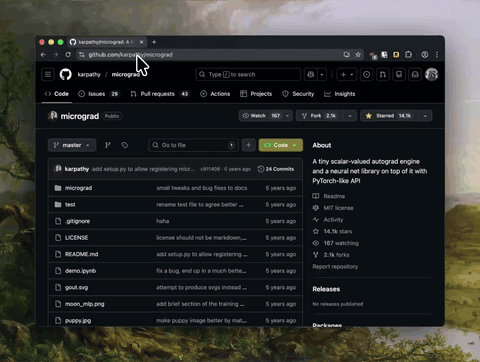

# nori

AI-powered code assistant for asking questions about GitHub repositories. Uses vector embeddings (VoyageAI), language-aware code chunking, and Claude to provide intelligent code analysis through a streaming chat interface.

Built with Next.js (frontend) and FastAPI + PostgreSQL + Chroma (backend).
